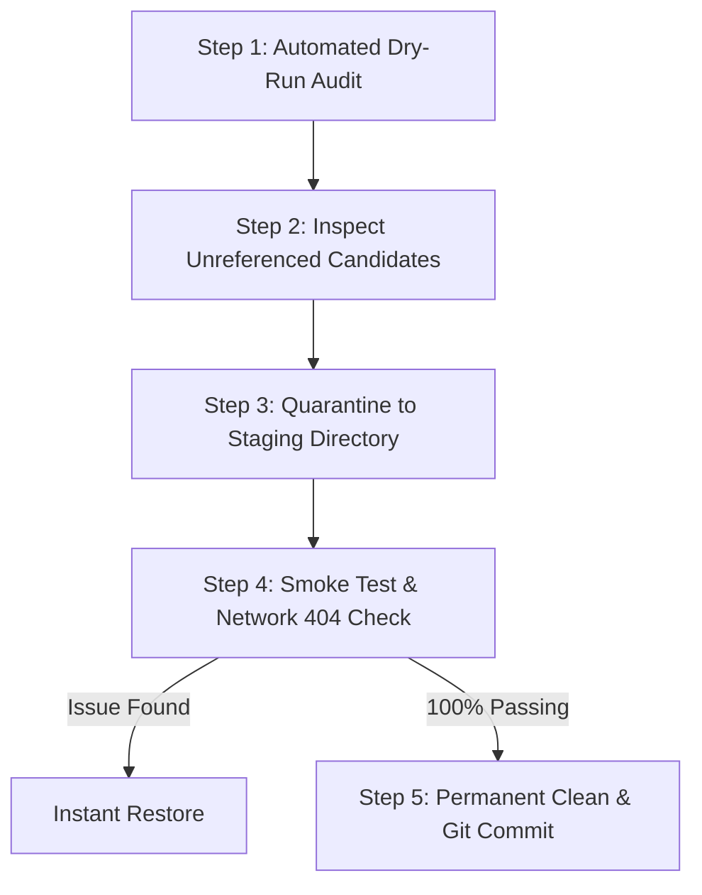

# Comprehensive Guide: Detecting & Safely Removing Unused Files in Web Projects

This guide outlines a reliable, step-by-step workflow to identify and safely remove orphaned assets—such as unused images, stylesheets, scripts, fonts, and data files—in web projects built with **HTML, CSS, JavaScript, and JSON**.

---

## 1. Why Blind Deletion Breaks Websites

In modern web development, files are not always linked using standard `` or `<link href="...">` tags. Common ways files are referenced that simple folder sweeps can miss:

| Reference Pattern | Example | Danger if Deleted |
| :--- | :--- | :--- |
| **CSS Backgrounds & Fonts** | `background-image: url('../images/bg.webp')`, `@font-face` | Broken page layouts or invisible fallback fonts |
| **Dynamic String Interpolation** | `const icon = `/icons/${status}.svg`` | Missing icons when specific user states trigger |
| **Extensionless Imports** | `const utils = require('./routing-engine')` | Runtime crashes (`MODULE_NOT_FOUND`) |
| **JSON Configuration Files** | `{"avatar": "assets/default-tutor.png"}` | Missing default images in dynamic user interfaces |
| **Clean Route Mapping** | `app.get('/why-combined', ... 'why-combined.html')` | Broken navigation routes (404 errors) |
| **Meta & PWA Manifests** | `<link rel="apple-touch-icon" href="...">`, `manifest.json` | Broken bookmarks, favicons, or mobile home-screen icons |

---

## 2. Recommended 5-Step Safe Deletion Workflow

Follow this 5-stage procedure to ensure **zero downtime or missing assets**:



### Step 1: Run the Automated Dry-Run Audit (Preview Mode)
A dedicated auditing tool [`audit-unused-assets.js`](file:///c:/Users/ds951/.gemini/antigravity-ide/scratch/combineTution/audit-unused-assets.js) is included directly in this project. It scans all `.html`, `.js`, `.css`, and `.json` files, extracts reference tokens, checks clean route mappings and extensionless imports, and outputs a formatted preview table without touching any files:

```bash
node audit-unused-assets.js
```

Or generate a structured JSON report for documentation:
```bash
node audit-unused-assets.js --json
```

### Step 2: Manually Review Flagged Candidates
Before moving or deleting any file flagged in the report:
1. **Search for substrings**: If an image `banner-v2.png` is flagged, check if parts of the name (e.g. `banner-`) are constructed dynamically in JavaScript:
   ```bash
   git grep "banner-"
   ```
2. **Check Database & API Seeders**: Check if URLs are populated in SQLite (`database.js`) or fetched from an external API.
3. **Check Build & Deployment Configs**: Verify if the file is specified in `netlify.toml`, `robots.txt`, or server redirects.

### Step 3: Use Quarantine / Staging (Do NOT Delete Directly)
Never execute permanent deletion (`rm` or `git rm`) immediately. Instead, move candidate files to a temporary staging folder (`.quarantine_backup/`) while preserving their relative directory paths:

```bash
# Safely moves suspect files to .quarantine_backup/ and creates a restoration manifest
node audit-unused-assets.js --quarantine
```

### Step 4: Smoke Test & Network Inspection
With suspect files quarantined:
1. Start your local development server:
   ```bash
   npm start
   ```
2. Open your browser and navigate to all primary views (`http://localhost:3000`, `jobs.html`, `login.html`, `tutor-dashboard.html`, `admin-dashboard.html`).
3. Open **Chrome DevTools (F12) &rarr; Network tab**:
   - Filter by **Status Code: 404**.
   - Navigate across pages and trigger modals, dropdowns, and button clicks.
   - If any `404 Not Found` appears in the Network panel, note the missing filename.
4. **If any asset was accidentally quarantined**, restore all files instantly:
   ```bash
   node audit-unused-assets.js --restore
   ```
   Then add that file to `ESSENTIAL_ENTRY_POINTS` in `audit-unused-assets.js`.

### Step 5: Final Cleanup & Git Version Control
If the smoke test passes with **zero 404 errors**:
1. You can now safely delete the temporary quarantine directory:
   ```bash
   # On Windows PowerShell:
   Remove-Item -Recurse -Force .quarantine_backup
   ```
2. Commit the clean state to Git:
   ```bash
   git add -A
   git commit -m "chore: remove verified unreferenced assets and orphaned files"
   ```

---

## 3. Complementary Browser & Diagnostic Tools

For analyzing unused code within active files (e.g. unused CSS rules or unused JS functions):

### 1. Chrome DevTools Code Coverage Tab
- Open DevTools (`F12` or `Ctrl+Shift+I`).
- Press `Ctrl+Shift+P` (Command Menu) and type **Coverage**, then select **Show Coverage**.
- Click the **Reload and start instrumenting coverage** button.
- Inspect exact percentages of unused CSS selectors and JS functions highlighted in red.

### 2. PurgeCSS (Automated CSS Dead-Code Pruner)
To strip unused CSS rules from large frameworks:
```bash
npx purgecss --css style.css --content index.html *.html *.js --output style.min.css
```

---

## 4. Script Command Quick Reference

| Command | Action | Safety Level |
| :--- | :--- | :--- |
| `node audit-unused-assets.js` | Scans project & prints formatted preview table | 🟢 **100% Safe (Read-Only)** |
| `node audit-unused-assets.js --json` | Exports audit findings to machine-readable JSON | 🟢 **100% Safe (Read-Only)** |
| `node audit-unused-assets.js --quarantine` | Moves unreferenced files to `.quarantine_backup/` | 🟡 **Safe (Reversible)** |
| `node audit-unused-assets.js --restore` | Restores all quarantined files back to their paths | 🟢 **Instant Rollback** |
